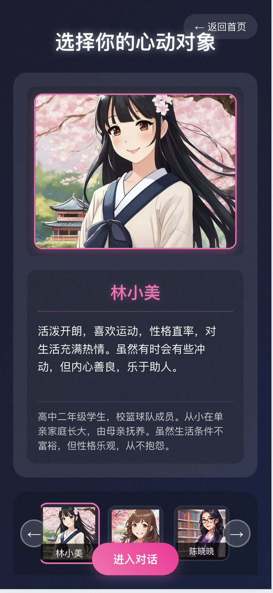
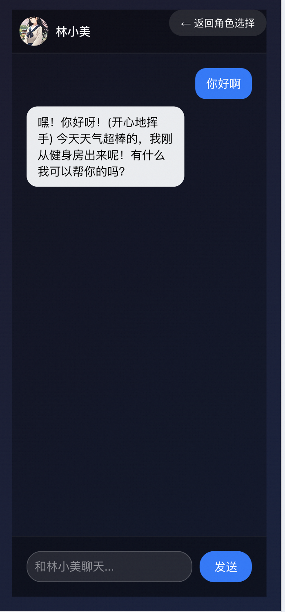
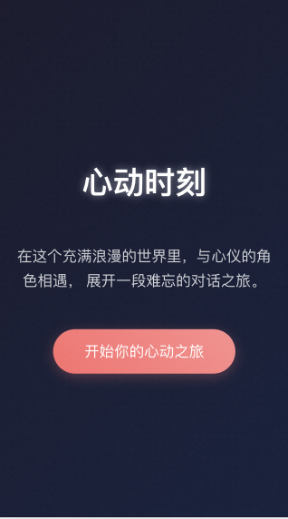

# NovelAI - 视觉小说游戏

一个基于 React 和 TypeScript 的视觉小说游戏，支持 AI 对话和图片生成功能。在这里，你可以与不同性格特征的角色进行互动对话，体验独特的视觉小说体验。

## 🌟 在线体验

访问 [http://8.130.88.48:3005/](http://8.130.88.48:3005/) 即可体验游戏。

## 📸 体验截图

### 角色选择界面

*选择你喜欢的角色开始对话*

### 对话界面

*与角色进行智能对话*

### 深色主题

*支持深色/浅色主题切换*

## 👥 角色设定

### 1. 温柔知性型
- 性格：温柔、知性、善解人意
- 对话风格：优雅、体贴、富有同理心
- 头像风格：知性优雅的职场女性形象
- 适合话题：文学、艺术、生活感悟

### 2. 活泼可爱型
- 性格：活泼、开朗、充满活力
- 对话风格：俏皮、幽默、充满朝气
- 头像风格：青春活力的少女形象
- 适合话题：日常趣事、娱乐、美食

### 3. 高冷御姐型
- 性格：高冷、独立、有主见
- 对话风格：简洁、犀利、略带傲娇
- 头像风格：成熟优雅的御姐形象
- 适合话题：事业、理想、人生规划

### 4. 邻家女孩型
- 性格：亲切、随和、平易近人
- 对话风格：自然、亲切、温暖
- 头像风格：清新自然的邻家女孩形象
- 适合话题：生活日常、兴趣爱好、情感

## ✨ 功能特点

- 🎮 多样化角色选择系统
- 💬 AI 智能对话（基于 DeepSeek API）
- 🎨 个性化角色立绘生成（基于 Stability API）
- 📱 响应式设计，支持移动端
- 🌙 深色/浅色主题切换
- 🎯 打字机效果
- 💫 流畅的动画效果
- 🎭 角色个性化对话系统

## 🚀 快速开始

### 环境要求

- Node.js 16.0 或更高版本
- npm 7.0 或更高版本

### 安装步骤

1. 克隆项目
```bash
git clone https://github.com/MatrixHero/novelai.git
cd novelai
```

2. 安装依赖
```bash
npm install
```

3. 配置环境变量
```bash
cp .env.example .env
```
然后编辑 `.env` 文件，填入你的 API keys：
- `REACT_APP_DEEPSEEK_API_KEY`: DeepSeek API key（用于 AI 对话）
- `REACT_APP_IMAGE_GEN_API_KEY`: Stability API key（用于图片生成）

4. 启动开发服务器
```bash
npm start
```

5. 构建生产版本
```bash
npm run build
```

### 本地开发

1. 启动开发服务器后，访问 `http://localhost:3000`
2. 修改代码后会自动热重载
3. 使用 `npm run build` 构建生产版本
4. 使用 `serve -s build` 本地预览生产版本

## 🛠️ 技术栈

- React 18
- TypeScript
- Styled Components
- DeepSeek API（AI 对话）
- Stability API（图片生成）
- React Router
- Framer Motion（动画效果）

## 📝 项目结构

```
src/
├── components/         # React 组件
├── services/          # API 服务
├── styles/            # 全局样式
├── types/             # TypeScript 类型定义
└── utils/             # 工具函数
```

## 🤝 贡献指南

1. Fork 项目
2. 创建特性分支 (`git checkout -b feature/AmazingFeature`)
3. 提交更改 (`git commit -m 'Add some AmazingFeature'`)
4. 推送到分支 (`git push origin feature/AmazingFeature`)
5. 创建 Pull Request

## 📄 许可证

本项目采用 MIT 许可证 - 查看 [LICENSE](LICENSE) 文件了解详情

## 🙏 致谢

- [DeepSeek](https://deepseek.com/) - AI 对话服务
- [Stability AI](https://stability.ai/) - 图片生成服务
- [React](https://reactjs.org/) - UI 框架
- [Styled Components](https://styled-components.com/) - CSS-in-JS 解决方案

## 📞 联系方式

- GitHub: [MatrixHero](https://github.com/MatrixHero)
- 项目主页: [https://github.com/MatrixHero/novelai](https://github.com/MatrixHero/novelai)
